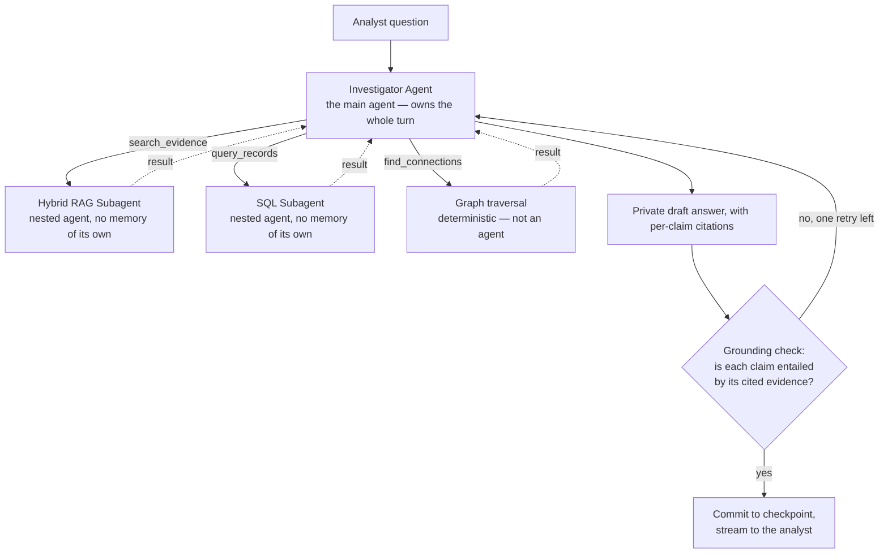
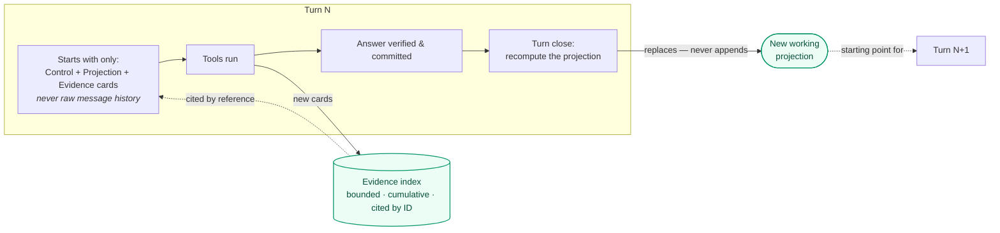

# Agent Layer

## Purpose

Once evidence exists as records, entities, and relationships (see [Data Layer](data-layer.md)),
something has to turn an analyst's question into a cited answer, across a multi-turn conversation,
without ever presenting an unverified guess as fact. That something is the investigation agent,
implemented as a FastAPI service, `services/investigation_agent`.

## The four moving pieces



There is exactly **one main agent**, **two sub-agents**, and **one deterministic tool**:

| Role | Name | What it is |
|---|---|---|
| Main agent | Investigator Agent | One LangChain `create_agent`, one per turn, checkpointed. Owns tool selection, strategy, and the final answer. |
| Sub-agent 1 | Hybrid RAG Subagent (`search_evidence`) | A small nested `create_agent` with one tool (`retrieve`) that runs BM25 + vector search and can retry up to three distinct queries. |
| Sub-agent 2 | SQL Subagent (`query_records`) | A small nested `create_agent` with one tool (`execute_sql`) that authors a query and can repair up to three distinct plans. |
| Tool | Graph RAG Tool (`find_connections`) | Deterministic, bounded graph traversal. No model call, no repair loop — just code with hard limits. |

Only the main agent is checkpointed and only it sees the running conversation. The two sub-agents
are stateless: each invocation gets a brand-new nested agent loop with no memory of the case, no
memory of prior turns, and no ability to see or write the main transcript. That containment is
deliberate — a bad SQL statement or an unproductive search query gets corrected *inside its own
small loop*, using only the tight feedback that loop needs (a rejected plan, a retrieval miss), and
never leaks half-formed reasoning, raw rows, or a failed query attempt into what the main agent (or
the analyst) sees. `find_connections` doesn't even need that: graph traversal from a known seed
entity, within server-owned depth/path/node/edge limits, is exact and repeatable, so there is
nothing for a model to get wrong.

All three tools are read-only, and all three receive the case ID from trusted server-side context
— never from anything the model writes. A tool cannot be asked, by the model or by evidence text,
to look at a different case.

## How a turn actually flows

1. The API validates the request and appends the exact user message to the checkpoint.
2. A cheap input guardrail runs before any tool is available, to catch an obviously unsafe request.
3. The main agent's model/tool loop runs inside hard limits (elapsed time, model calls, tool calls).
   It may call any of the three tools, in any order, more than once.
4. Every tool result is guarded (evidence text is normalized and explicitly delimited as untrusted
   data) and merged into the durable evidence index before the model sees it again.
5. When the model is done, it must return a structured `AnswerDraft`: the answer text plus a list of
   claims, each claim tagged `verified` / `proposed` / `hypothesis` / `limitation` and — for any
   material factual claim — the evidence IDs that support it.
6. A separate grounding check asks, for each material claim, "is this specific claim actually
   entailed by its cited evidence?" A claim that fails, or an unsupported claim, sends the draft
   back for one repair attempt; a second failure ends the turn as a safe failure rather than release
   an ungrounded answer.
7. Only after grounding passes is the answer committed to the checkpoint. Nothing is streamed to the
   analyst before that — the visible "progress" events during a turn are coarse phase labels
   (`searching_evidence`, `querying_records`, ...), never draft text, prompts, or raw evidence.
8. At the very end of the turn, the working summary described below is refreshed for next time.

A retrieval miss, an empty query result, or an exhausted tool budget is reported as "no support
retrieved" — the agent is explicitly instructed to never restate that as "the event did not
happen."

## How it remembers a conversation

> **The idea:** memory is one small, wholly-replaceable summary plus a bounded, cited evidence
> index — never a growing transcript of raw tool output. A naive chat agent just keeps resending
> every past message; this one deliberately doesn't.



Three things travel across turns:

| Section | Holds | Behavior |
|---|---|---|
| **Control** | Case ID, policy version | Fixed for the thread |
| **Evidence index** | One card per piece of evidence any tool ever returned — ID, kind, source, `confirmed`/`proposed` status | Grows by upsert; cited by ID, never re-sent in full |
| **Working projection** | Goal, dialogue summary, resolved referents, focused evidence, qualified hypotheses, open questions | *Replaced whole* at every turn close |

The projection is model-written, but it can't lie by construction: it may only cite evidence IDs
already in the index, a finding built on `proposed` evidence must say so, and it can never turn "no
support retrieved" into "this didn't happen." A replacement that breaks a rule gets one repair
attempt, then is discarded in favor of the previous projection, marked stale.

### What a turn actually sees

Illustrative content from the running scenario, not a literal log:

```text
Control: {"case_id": "case_trg_001", "policy_version": "trg-policy-v1.0.0"}

Working projection:
{
  "user_goal": "Assess whether Mavridis is linked to the EUR 9,800 transfer on 5 March.",
  "focus_evidence_ids": ["docs:R-01", "bank:t_88"],
  "hypotheses": [{"statement": "The phone may belong to Mavridis (proposed).",
                   "evidence_ids": ["docs:R-01"], "qualification": "proposed"}],
  "open_questions": ["Does INV-2231 also appear in a document, not just the transaction?"]
}

Evidence index (cite these IDs):
- docs:R-01 [chunk, proposed, via search_evidence] <untrusted-evidence>"...uses telephone +30 697 123 4567..."</untrusted-evidence>
- bank:t_88 [row, confirmed, via query_records] <untrusted-evidence>amount_minor=980000 currency=EUR remittance_info=INV-2231</untrusted-evidence>
```

No raw SQL, no full retrieval payloads, no message-by-message history from earlier turns — just
this compact bundle, plus the current turn's own tool calls, trimmed to a token budget if the turn
runs long.

For the exhaustive, machine-facing state and API contracts, see the
[`add-investigation-agent-service`](../openspec/changes/add-investigation-agent-service/) change
and [docs/DESIGN.md, §10](../docs/DESIGN.md).

Next → [AI-Assisted Development](ai-assisted-development.md)
