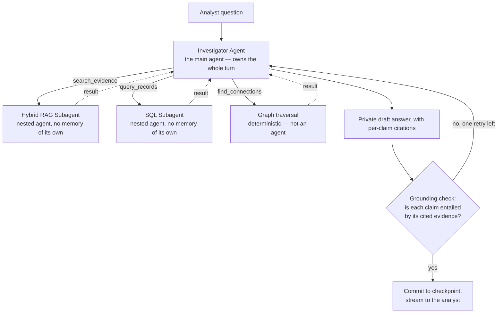
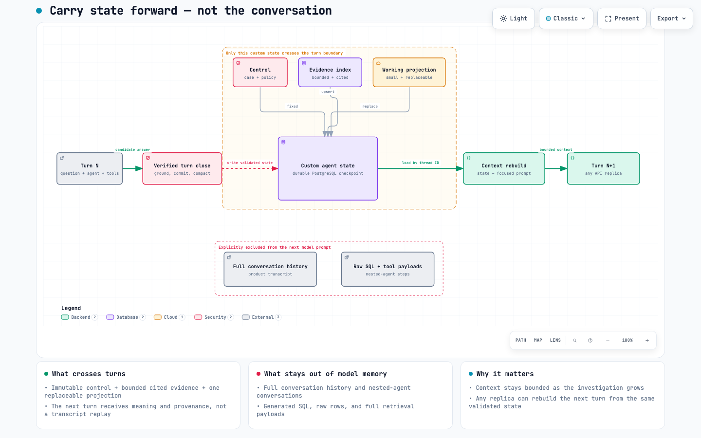

# Agent Layer

## Purpose

Once evidence exists as records, entities, and relationships (see [Data Layer](data-layer.md)),
something has to turn an analyst's question into a cited answer, across a multi-turn conversation,
without ever presenting an unverified guess as fact. That something is the investigation agent,
implemented as a FastAPI service, `services/investigation_agent`.

## The four moving pieces



There is exactly **one main agent**, **two sub-agents**, and **one deterministic tool**:

| Role | Name | What it is |
|---|---|---|
| Main agent | Investigator Agent | One LangChain `create_agent`, one per turn, checkpointed. Owns tool selection, strategy, and the final answer. |
| Sub-agent 1 | Hybrid RAG Subagent (`search_evidence`) | A small nested `create_agent` with one tool (`retrieve`) that runs BM25 + vector search and can retry up to three distinct queries. |
| Sub-agent 2 | SQL Subagent (`query_records`) | A small nested `create_agent` with one tool (`execute_sql`) that authors a query and can repair up to three distinct plans. |
| Tool | Graph RAG Tool (`find_connections`) | Deterministic, bounded graph traversal. No model call, no repair loop — just code with hard limits. |

Only the main agent is checkpointed and only it sees the running conversation. The two sub-agents
are stateless: each invocation gets a brand-new nested agent loop with no memory of the corpus, no
memory of prior turns, and no ability to see or write the main transcript. That containment is
deliberate — a bad SQL statement or an unproductive search query gets corrected *inside its own
small loop*, using only the tight feedback that loop needs (a rejected plan, a retrieval miss), and
never leaks half-formed reasoning, raw rows, or a failed query attempt into what the main agent (or
the analyst) sees. `find_connections` doesn't even need that: graph traversal from a known seed
entity, within server-owned depth/path/node/edge limits, is exact and repeatable, so there is
nothing for a model to get wrong.

All three tools are read-only and query the complete configured evidence store. Neither model text
nor conversation state can introduce a hidden evidence partition.

## How a turn actually flows

1. The API validates the request and appends the exact user message to the checkpoint.
2. A cheap input guardrail runs before any tool is available, to catch an obviously unsafe request.
3. The main agent's model/tool loop runs inside hard limits (elapsed time, model calls, tool calls).
   It may call any of the three tools, in any order, more than once.
4. Every tool result is guarded (evidence text is normalized and explicitly delimited as untrusted
   data) and merged into the durable evidence index before the model sees it again.
5. When the model is done, it must return a structured `AnswerDraft`: the answer text plus a list of
   claims, each claim tagged `verified` / `proposed` / `hypothesis` / `limitation` and — for any
   material factual claim — the evidence IDs that support it.
6. A separate grounding check asks, for each material claim, "is this specific claim actually
   entailed by its cited evidence?" A claim that fails, or an unsupported claim, sends the draft
   back for one repair attempt; a second failure ends the turn as a safe failure rather than release
   an ungrounded answer.
7. Only after grounding passes is the answer committed to the checkpoint. Nothing is streamed to the
   analyst before that — the visible "progress" events during a turn are coarse phase labels
   (`searching_evidence`, `querying_records`, ...), never draft text, prompts, or raw evidence.
8. At the very end of the turn, the working summary described below is refreshed for next time.

A retrieval miss, an empty query result, or an exhausted tool budget is reported as "no support
retrieved" — the agent is explicitly instructed to never restate that as "the event did not
happen."

## Memory that survives long investigations — and scale

Most chat agents “remember” by replaying an ever-growing transcript. That works in a demo, then
gets slower, more expensive, and less reliable as an investigation grows. This agent does something more
deliberate: after a verified turn, it converts the useful state of the investigation into a compact,
validated PostgreSQL checkpoint.

Instead of carrying the full conversation history into Turn N+1, the service carries a **custom
agent state**: immutable control, a bounded evidence index, and one replaceable working projection.
The next turn receives what matters, what remains open, and which evidence supports it — even after
a process restart or when another API replica handles the request.

[](diagrams/agent-memory/agent-memory.html)

### Three parts, each with one job

| Memory section | What survives | Why it matters |
|---|---|---|
| **Control** | Policy version and state-schema version | A thread cannot silently change system policy. |
| **Evidence index** | Bounded, deduplicated evidence cards with stable IDs, source references, and `confirmed` / `proposed` status | Citations remain traceable across turns without replaying raw tool output. |
| **Working projection** | The current goal, resolved references, focused evidence, qualified hypotheses, open questions, and next steps | The conversation stays coherent without carrying the whole conversation. The projection is replaced, not appended. |

Before every model call, trusted code rebuilds the prompt from:

```text
immutable control + latest working projection + bounded evidence cards + current turn
```

The model never receives the product transcript, prior nested-agent conversations, generated SQL,
or full retrieval payloads. The product transcript remains available through the history API, but
it does not become model memory; the other private artifacts are not product history.

### Why this stays trustworthy

- **Memory cannot manufacture evidence.** Every evidence reference in the projection must already
  exist in the index, and `proposed` evidence cannot be promoted by the summary.
- **Compaction fails safely.** An invalid projection gets one repair attempt. If that also fails,
  the last valid projection is kept and marked stale instead of storing a plausible-looking summary.
- **Missing evidence stays missing evidence.** “No support retrieved” is never compacted into “the
  event did not happen.”
- **The answer and its memory advance together.** Synchronous checkpointing makes the committed,
  grounded answer the durable boundary before the next turn begins.

### Why this survives scale

- **No sticky memory:** continuity lives in PostgreSQL, not in a Python process. A restarted service
  or another replica can reconstruct the thread from its checkpoint.
- **Bounded work per turn:** the projection has explicit field limits; the evidence index is bounded
  and evicts the oldest unreferenced cards while recording incomplete coverage; the model receives
  bounded card displays and a trimmed current-turn context.
- **Safe retries:** a completed `request_id` is replayed without repeating agent or database work;
  an interrupted request resumes from its last synchronous checkpoint without appending the user
  message again.
- **Concurrency by thread:** different investigations are independent and can run concurrently;
  only turns within the same thread must be serialized.

> **Production boundary:** the current prototype serializes a thread with an in-process lock. The
> durable memory model already supports restarts and replica handoff, but active-active replicas
> need a distributed/advisory lock or equivalent routing rule to prevent two simultaneous turns on
> the same thread. This is coordination around the memory — not a redesign of it.

For the exhaustive, machine-facing state and API contracts, see the
[`add-investigation-agent-service`](../openspec/changes/archive/2026-09-03-add-investigation-agent-service/) change
and [docs/DESIGN.md, §10](../docs/DESIGN.md).

Next → [AI-Assisted Development](ai-assisted-development.md)
