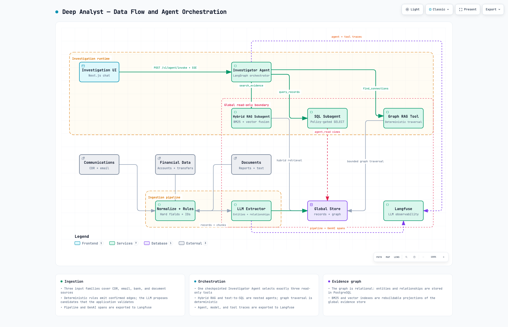

# Architecture

## Purpose

This page is the big picture: what the running pieces are, and how a fact travels from a raw
source file to a cited sentence in the analyst's answer. [Data Layer](data-layer.md) and
[Agent Layer](agent-layer.md) go deeper into the two halves introduced here.

## The picture

Click the diagram to open the interactive version (pan, zoom, light/dark) in the browser.

Three source families — communications, financial data, and documents — go through an **ingestion
pipeline** once, on startup. Ingestion writes everything to one **evidence graph database**
(ordinary PostgreSQL tables, not a separate graph product). An **investigation runtime** reads that
database through three read-only tools to answer questions in the **investigation UI**. Everything
that happens is exported as traces to **Langfuse** for inspection.

## Two halves, one deterministic/LLM boundary

| Stage | What happens | Deterministic or LLM? |
|---|---|---|
| Ingestion: normalize | Read a source record, normalize hard fields (phone numbers, IBANs, amounts, timestamps) | Deterministic code |
| Ingestion: extract | Turn structured fields into confirmed graph edges; turn prose into candidate entities and relationships | Rules first, then a constrained LLM for prose |
| Ingestion: index | Chunk searchable text and build a lexical (BM25) and a semantic (vector) index over it | Deterministic code + an embedding model |
| Investigation: retrieve | Search text, query structured records, traverse the graph | A tool decides *what* to ask for; retrieval and traversal execution are deterministic |
| Investigation: answer | Compose a cited answer from returned evidence | LLM, verified before release |

The same principle repeats at every layer: **code owns exact structure, the model owns meaning in
free text, and nothing the model writes reaches the analyst before it is checked against the
evidence it claims to be based on.**

## The ingestion pipeline

One one-shot container turns a dataset edition's raw files into the evidence store: it creates a
common `records` row for every source item, normalizes hard fields, creates confirmed graph edges
from explicit structured fields (a transaction's debtor and creditor, a call's two phone numbers),
chunks and indexes searchable text, and sends prose chunks through a constrained LLM extraction
step that proposes additional entities and relationships. [Data Layer](data-layer.md) walks
through this in detail.

## The evidence graph database

The graph is not a separate database technology — it is three ordinary PostgreSQL tables
(`records`, `entities`, `relationships`) plus rebuildable search indexes, all on one ParadeDB
instance (PostgreSQL with the `pg_search` and `pgvector` extensions). A small dataset with shallow
investigative paths does not need dedicated graph infrastructure; [Data Layer](data-layer.md)
explains why.

## The investigation runtime

One **Investigator Agent** (the main agent) owns each conversational turn. It has exactly three
read-only tools: a **Hybrid RAG Subagent** for text search, a **SQL Subagent** for structured
queries, and a deterministic **Graph RAG Tool** for bounded graph traversal. The first two are
themselves small nested agents that can retry or repair their own query without ever seeing the
rest of the conversation; the third is not an agent at all, just bounded traversal code. A
conversation's durable state — a bounded evidence index, a compact working summary, and the turn
history — is checkpointed in the same PostgreSQL database, behind a separate least-privilege schema
and role from the evidence itself. [Agent Layer](agent-layer.md) is the deep dive.

## The investigation UI

`investigation-web` is a thread-oriented Next.js chat application. It streams progress and the final
answer over Server-Sent Events, lists and reopens past conversations from the same checkpoints the
agent writes, and lets every fresh conversation query the global evidence store. It has no
authentication layer — this prototype assumes a single trusted analyst per deployment, not a
multi-tenant product.

## Observability

Every ingestion run and every agent turn is exported as OpenTelemetry traces. A local Langfuse
instance gives an LLM-specific view (prompts, tool calls, token usage) with sensitive content
redacted by default; a local Grafana/Tempo/Loki/Prometheus stack gives the operational view. This
is development tooling, not part of the answer path — see the root
[README](../README.md#5-optional-local-observability) if you want to run it.

## Design principles behind this shape

1. **Deterministic where possible, LLM where useful.** Parsing, exact filters, and graph traversal
   are code; the model handles semantic structure in prose and multi-step investigation strategy.
2. **Evidence stays attached.** Every relationship and every returned finding keeps a pointer back
   to the record and field or text span that supports it.
3. **Identifiers are not actors.** A phone number is not a person; an account is not its owner.
   Use and ownership are explicit, sourced relationships, not identity shortcuts.
4. **Source content is untrusted data.** A document can contain a false claim, or text that reads
   like an instruction. Neither is allowed to control the system — see the dataset's `A-D1` case in
   [Dataset](dataset.md).
5. **The analyst owns the conclusion.** The system produces a sourced, preliminary view, not a
   final legal or intelligence assessment.

Next → [Data Layer](data-layer.md)
