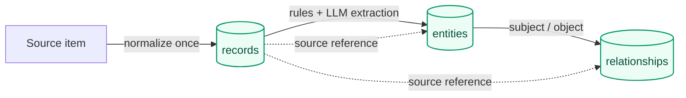
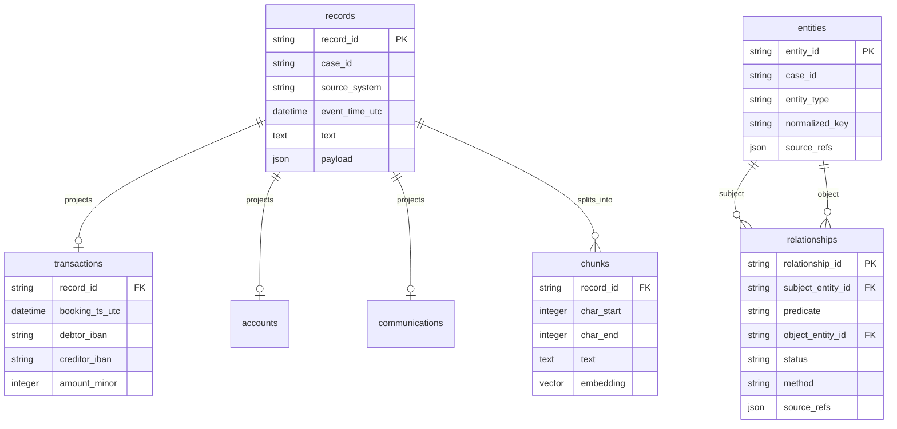

# Data Layer

## Purpose

The three source systems don't share a join key. A document may name a person and a phone; a
communications record may contain only two phone numbers; a transaction may contain two accounts
and a free-text reference. This page explains the small shared model that connects those
observations without hiding where a connection came from, and the one-shot pipeline that builds it.

## Three different shapes, one common envelope

| Source | Shape | Useful evidence |
|---|---|---|
| Communications | High-volume, semi-structured events (CDR, device extraction, email) | Parties, channel, time, sometimes content |
| Transactions | Structured, relational data | Accounts, amount, currency, time, reference |
| Documents | Unstructured text | People, organizations, aliases, claims, context |

Every adapter turns its source into the same envelope, then lets deterministic code and a
constrained model add structure on top:

```text
read source
  --> create a common record
  --> normalize hard fields (phones, IBANs, money, time, references)
  --> create deterministic entities and relationships from explicit structured fields
  --> chunk and index searchable text
  --> run constrained LLM extraction over prose
  --> store proposed semantic relationships
```

This runs once per case as a one-shot, idempotent pipeline: a run that matches a prior completed
run's fingerprint (dataset contents, embedding model, chunking configuration) is skipped without
touching the database; anything else is a full, safe-to-repeat rebuild, because every write
upserts on a stable natural key.

## The three tables

Everything downstream is built from three source-of-truth tables:

```text
record        the normalized evidence received from one source item
entity        a typed thing that can recur across records (a phone, a person, an account...)
relationship  a sourced, typed connection between two entities
```



A **record** is one source item in a common shape: case, source system, type, UTC and original
timestamp, searchable text (if any), and the source-specific structured payload. For example,
transaction `t_88` stores its debtor and creditor accounts, `amount_minor = 980000`, currency,
booking time, and the reference `INV-2231` in its payload.

An **entity** is a reusable node. An exact normalized identifier can reuse an existing entity of
the same type — the phone forms `+30 697 123 4567` and `306971234567` become one `PHONE` entity.
Actor names are different: two `PERSON` or `ORGANIZATION` mentions with an equal or similar name
are **never** automatically merged, because the fixture deliberately contains a second, unrelated
person named Mavridis.

A **relationship** is always a sourced assertion, never a bare fact: subject, predicate, object,
plus a `status` of `confirmed` or `proposed`, a `method` of `deterministic` or `llm`, and at least
one source reference (a record plus an exact text span or a named field).

- `confirmed` + `deterministic` means a reproducible rule copied an explicit structured statement
  into the graph — a call's two endpoints, a transaction's debtor and creditor.
- `proposed` + `llm` means the edge depends on semantic interpretation of prose, or on an actor
  identity that isn't certain.

"Confirmed" describes how the edge was extracted, not whether the underlying source is objectively
true — a confirmed edge still just means the database faithfully represents what a structured
source says.

## Small ontology

| Family | Types | Rule |
|---|---|---|
| Actor | `PERSON`, `ORGANIZATION` | Names alone never establish identity |
| Identifier | `PHONE`, `EMAIL_ADDRESS` | Exact normalized values may reuse the same node |
| Asset | `DEVICE`, `FINANCIAL_ACCOUNT`, `VESSEL` | An asset's identifier identifies the asset, not its user or owner |
| Event | `TRANSACTION` | A stable transaction ID identifies the recorded event, not its purpose |
| Reference | `INVOICE_REF` | An exact reference identifies the token, not the underlying event |
| Place | `LOCATION` | Free-text similarity creates a candidate, not a fact |

| Predicate | Subject → Object | Meaning |
|---|---|---|
| `USES` | `PERSON` → `PHONE`/`DEVICE` | A source attributes use of an identifier or asset |
| `ASSOCIATED_WITH` | `PERSON` → `ORGANIZATION` | A general association, no ownership implied |
| `HELD_BY` | `FINANCIAL_ACCOUNT` → actor | An account record names its holder |
| `COMMUNICATED_WITH` | compatible endpoints | A communication occurred between two identifiers |
| `TRANSFERRED_TO` | account → account | A transaction moved money between accounts |
| `REFERENCES` | `TRANSACTION` → `INVOICE_REF` | The remittance text contains a reference |

The list is deliberately small; a new predicate is added only once its meaning and allowed
endpoints are clear. The store rejects any edge whose endpoint types don't match this table, so a
malformed edge such as `PHONE --HELD_BY--> PERSON` cannot enter the graph.

## Deterministic rules and the model have different authority

Code handles hard structure: phone/email/IBAN/reference normalization, timestamps, money, call and
transaction endpoints. Those edges are `confirmed` because the extraction is exactly reproducible.

The model handles names, organizations, aliases, and semantic statements in prose. It must return
constrained candidates — entity type, exact text and character offsets, predicate, typed endpoints,
and an exact supporting quote — and the host then:

1. verifies the quoted text actually occurs at the claimed offset in the source;
2. applies deterministic normalization where one exists;
3. checks that the subject and object types are allowed for that predicate;
4. rejects a relationship that rests on co-occurrence alone;
5. stores what survives as `proposed`, never `confirmed`.

Span validation limits outright fabrication, but it cannot prove the model read the sentence
correctly — which is exactly why semantic relationships stay `proposed` and must be expressed
conditionally in any answer built from them. When a rule and the model land on the same exact
identifier, the rule's entity wins.

## Fast, rebuildable projections

Putting every source-specific field only in a record's JSON payload would make ordinary filters
depend on JSON path expressions. Ingestion therefore also rebuilds four typed projection tables on
every run, each pointing back to its parent record:

| Table | Rebuilt from | Answers |
|---|---|---|
| `transactions` | transaction records | Which transfers match this time, amount, or account? |
| `accounts` | account records | Who is named as holder of this IBAN? |
| `communications` | CDR, device extraction, and email records | Which events involve this endpoint and time window? |
| `chunks` | every record with searchable text | Which evidence text matches these words, or this meaning? |

These are query accelerators, not additional evidence — if one is lost or its shape changes,
ingestion can always recreate it from `records`. `chunks.text` gets a `pg_search` BM25 index for
exact terms, names, and references; `chunks.embedding` gets a pgvector HNSW cosine index for
paraphrase and semantic similarity. A transaction's remittance text is indexed the same way as a
document's prose, so an exact reference like `INV-2231` is lexically retrievable from either.

## Compact relational view



## Worked example

1. Report `R-01` becomes a document record and produces a searchable chunk.
2. Deterministic rules create a `PHONE` entity from `+30 697 123 4567`.
3. The LLM proposes `Alexandros Mavridis --USES--> PHONE`, supported by an exact sentence in `R-01`.
4. Carrier metadata and a device-extraction record both support a confirmed `PHONE
   --COMMUNICATED_WITH--> PHONE` relationship between that phone and another.
5. Account records create confirmed `HELD_BY` relationships for the accounts involved.
6. Transaction `t_88` creates a confirmed `TRANSFERRED_TO` relationship and preserves €9,800 and
   `INV-2231` in its structured payload; that same reference is also indexed as text.

Chaining these gives an investigator a plausible path from a named person to a specific transfer —
but the path alone does not prove that the named person authored the phone's activity, controlled
either company, or that the transfer was improper. Every relationship on the path carries its own
status, so the final answer can say exactly which steps are confirmed and which are still proposed.

## Invariants worth remembering

1. Identifiers and assets stay separate from the actors who may use or hold them.
2. Names alone never merge two people or organizations.
3. Every relationship carries source evidence, a method, and a status.
4. LLM-derived semantic relationships are always `proposed`, never `confirmed`.
5. Co-occurrence alone is never a confirmed relationship.
6. Money is integer minor units; time comparisons use UTC while the original value is retained.

For the exhaustive, machine-facing contract, see
[docs/DATA_MODEL.md](../docs/DATA_MODEL.md) and the
[`evidence-store`](../openspec/specs/evidence-store/spec.md) and
[`ingestion-pipeline`](../openspec/specs/ingestion-pipeline/spec.md) specifications.

Next → [Dataset](dataset.md)
